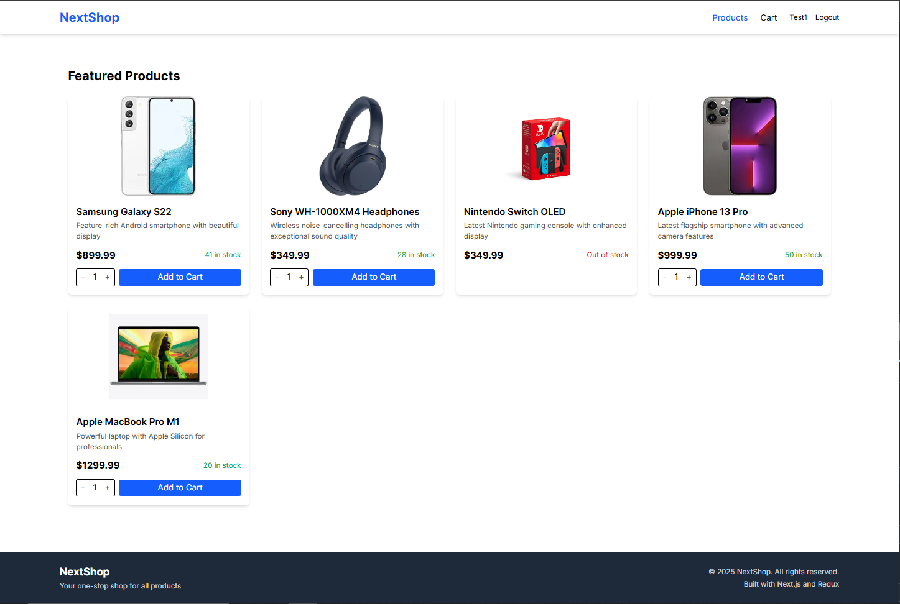

````markdown
# E-Commerce Platform with Real-Time Inventory

[](https://ecommerce-frontend-kappa-eight.vercel.app/)


A modern e-commerce application featuring real-time inventory updates across users. Built with Next.js 15, Tailwind CSS, and Redux, backed by a Node.js/Express API with WebSocket integration.



## Features

- **Real-Time Product Inventory**  
  Instant stock updates via WebSocket connections when users make purchases
- **Product Catalog**  
  Browse products with details (name, description, price, stock status)
- **Smart Cart System**
  - Quantity adjustments with stock validation
  - Cart persistence with Redux
  - Interactive summary with total calculation
- **Secure Checkout**  
  Inventory validation and stock deduction on successful purchases
- **Responsive UI**  
  Mobile-first design with Tailwind CSS
- **JWT Authentication** (Bonus)  
  Protected routes and user-specific sessions

## Tech Stack

**Frontend**

- Next.js 15 (App Router)
- Tailwind CSS + Headless UI
- Redux Toolkit with RTK Query
- WebSocket Client

**Backend**

- Node.js + Express
- WebSocket Server
- MongoDB 
- JWT Authentication

## Getting Started

### Prerequisites

- Node.js v18+
- MongoDB
- npm or yarn

### Installation

1. Clone the repository

```bash
git clone https://github.com/rushit-kakadiya/ecommerce-realtime.git
cd ecommerce-realtime
```
````

2. Install dependencies

```bash
# Frontend
cd src/frontend
npm install

# Backend
cd ../backend
npm install
```

3. Set up environment variables

```bash
# Frontend .env.local
NEXT_PUBLIC_API_URL=http://localhost:3001
NEXT_PUBLIC_WS_URL=ws://localhost:3001

# Backend .env
DATABASE_URL=mongodb://localhost:27017/ecommerce
JWT_SECRET=your_jwt_secret
PORT=3001
```

### Running the App

```bash
# Start backend
cd src/backend
npm run dev

# Start frontend (in separate terminal)
cd src/frontend
npm run dev
```

Visit `http://localhost:3000` in your browser.

## Real-Time Implementation

The application uses WebSocket for instant inventory updates:

1. Server broadcasts stock changes through WebSocket
2. Client listens to `stock-update` events
3. Redux store updates relevant product stock
4. UI components re-render with new values

```javascript
// Example WebSocket handler
socket.on("stock-update", (updatedProducts) => {
  store.dispatch(updateStocks(updatedProducts));
});
```

## Project Structure

```
/src
├── app          # Next.js app router entries
├── components   # Reusable UI components
├── redux        # Redux store and slices
├── lib          # WebSocket and API clients
├── providers    # Context providers
└── styles       # Global CSS/Tailwind
```

## Contributing

Contributions are welcome! Please follow these steps:

1. Fork the repository
2. Create your feature branch (`git checkout -b feature/amazing-feature`)
3. Commit your changes (`git commit -m 'Add some amazing-feature'`)
4. Push to the branch (`git push origin feature/amazing-feature`)
5. Open a Pull Request

## License

Distributed under the MIT License. See `LICENSE` for more information.

## Acknowledgments

- Next.js App Router patterns
- Redux Toolkit best practices
- Real-time synchronization techniques
- Tailwind CSS responsive design principles
